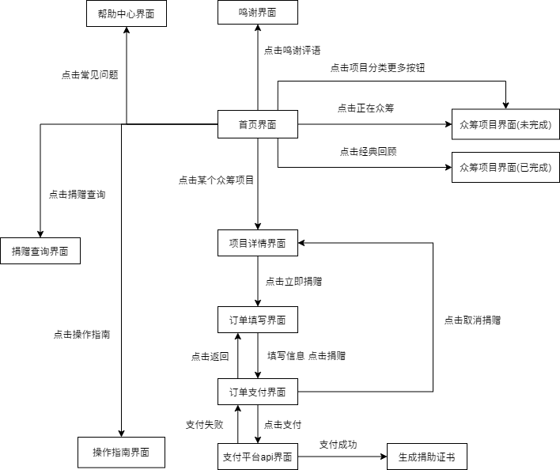

## Donate-Web

> 校友众筹平台前端开发仓库

### 项目部署

```js
# 安装依赖
npm install
# 项目启动
npm start
```

### 1. 规范协作

本仓库有2个分支，master和dev。主要在dev分支上进行开发和测试，功能完善之后再合并到master。

```
|- master
|- dev
```

#### 1.1 准备工作

在github上fork本仓库到你自己的github，将你fork之后的远程仓库克隆到本地，并在你的本地仓库上添加上游仓库，即源仓库。fork一般是fork了仓库的master分支，所以可能还需要自己去切出dev分支然后拉取源仓库dev分支上的内容。

``` 
git clone https://github.com/{你的github}/donate-web
# 上游的源仓库地址只需添加一次
git remote add upstream https://github.com/SikeX/donate-web.git
# 切出dev分支并拉取源仓库dev分支上的内容
git checkout -b dev
git pull upstream dev
```

#### 1.2 协作方式

要开发某个模块的时候，在你的本地仓库创建一个分支，例如mydev。

```
git checkout -b mydev
```

切换之后你的本地仓库上就有3个分支了，如下所示。checkout之后会自动切换到mydev分支。

```
├─master
├─dev
└─mydev
```

在mydev分支上进行开发和测试，完成相应的功能或者模块，完成之后再切回到dev分支将mydev的内容合并到dev。

```
# mydev分支上提交你的更新
git add *
git commit -m "add something"
# 切换到dev分支
git checkout dev
```

由于在你开发过程中，我也可能在开发并且更新了仓库，为了避免冲突，在合并分支之前你还需要更新你本地仓库的dev分支。先在本地仓库上添加上游仓库upstream，上游仓库即我的仓库，然后使用pull命令从上游仓库拉取更新。

```
# 拉取上游的源仓库dev分支上的更新
git pull upstream dev
```

更新完dev之后，将mydev分支合并到dev分支并提交到你自己的远程仓库。完成之后，mydev分支就可以删除了，你也可以继续留着。

```
# 将mydev分支合并到dev，可能会有冲突需要自行解决
git merge mydev
# 推送到你自己的远程仓库，注意这里是push到origin dev，不是upstream dev
git push origin dev
# 删除mydev分支
git branch -d mydev
```

推送到自己的远程仓库后，就可以到github上面给我发Pull Request了，然后等待我合并你的代码。

## 2. 项目结构

```
├── craco.config.js
├── package-lock.json
├── package.json
├── public: webpack不参与编译的文件
│   ├── favicon.ico
│   ├── index.html
│   ├── manifest.json
│   └── robots.txt
├── src: 项目源码
│   ├── App.js
│   ├── App.test.js
│   ├── common
│   ├── components: 组件
│   │   ├── DonateChoose.js 
│   │   ├── DonateClass.js
│   │   ├── DonateItem.js
│   │   ├── DonateStatus.js
│   │   ├── Footer.js
│   │   ├── Head.js
│   │   ├── MultipleSlider.js
│   │   ├── MySlider.js
│   │   ├── Nav.js
│   │   ├── SlickItem.js
│   │   ├── StatusBar.js
│   │   ├── Thanks.js
│   │   └── test.rest
│   ├── index.css
│   ├── index.js
│   ├── logo.svg
│   ├── pages: 页面
│   │   ├── Donate.js
│   │   ├── DonateDetail.js
│   │   ├── Home.js
│   │   └── Order.js
│   ├── reportWebVitals.js
│   ├── setupTests.js
│   └── utils
│       └── dataProcess.js
└── tailwind.config.js
```

项目模块结构和界面跳转关系



## 3、开发规范

1. React组件文件名使用首字母大写驼峰形式命名，例如"HelloWorld.js"；方法采用小写字母驼峰命名法，例如"addItem()"，以符合HTML标签的规范
2. 文件夹采用小写短线形式命名，例如"images-for-readme"
3. 代码缩进为4个空格；语句末尾全部不写分号；其他代码风格细节参考eslint的提示进行修改
4. 使用tailwind+es6进行开发
5. 各个界面在路由中已经引入并写好跳转关系，如果界面中需要用到自定义组件请将组件放置在该界面所在的文件夹里面
6. 伪数据程程器和伪数据json文件都放置在data文件夹下面。生成器和json文件的命名格式为"xxx-genertor.js"和"xxx.json"，其实"xxx"为上述各个数据模型的英文名称
7. 样式大小单位使用rem，不使用px。